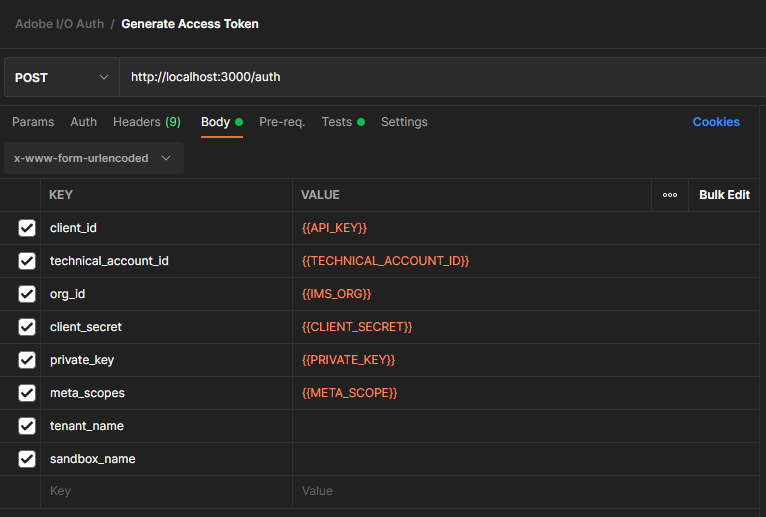

# adobe_io_developer_app
 
A simple Node.js app that allows you run a local http server to sign/auth a JWT and respond with access credentials for a specific I/O integration and psql connection params.

## Installation Instructions
This instruction list applies for users installing via Ubuntu in WSL

### Dependencies
* node.js - https://nodejs.org/en/download/
* Express - https://expressjs.com/en/starter/installing.html
* @adobe/jwt-auth - https://github.com/adobe/jwt-auth


### Step by Step instructions
1. Download git repo to your desktop and store in a directory  
```
Example:  /mnt/c/users/eknee/apps/adobe_auth/
```

2. Install node.js  
```
sudo apt-get update
sudo apt-get install nodejs
```

3. Install npm (nodes package manager)  
```
sudo apt-get install npm
```

4. Navigate to the directory you downloaded the initial repo and install express
```
cd /mnt/c/users/eknee/apps/adobe_auth/
npm install express --save
```

5. In the same directory also install @adobe/jwt-auth  
```
npm install @adobe/jwt-auth
```

## Start your local auth server
To start the server simple navigate to the directory where you did the installation and execute the following command:
```node auth.js```
You should then see this response in the CLI interface  
```Started server at http://localhost:3000```


## Setup Postman
Import the postman collection from the directory you downloaded the repo in.  You should see the following in postman  


The request is pre-configured to use use the existing postman environment variables you can download with your integraiton in Adobe I/O  


A successful respone should return the payload shown below which is automatically parsed and appended to your environments ACCESS_TOKEN variable.  You can then reference that in all subsequent calls.
```
{
    "token_type": "bearer",
    "access_token": "XXXXXXXX",
    "expires_in": 86399988,
    "psql": "psql 'sslmode=require host=somehostname.platform-query.adobe.io port=80 dbname=prod:all user=someorg@AdobeOrg password=XXXXX'"
}
```


